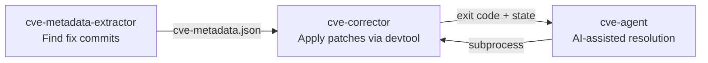

<!-- SPDX-License-Identifier: MIT -->
# yocto-security-tools

Standalone CVE management tools for Yocto/OpenEmbedded Linux distributions.

## Tools

| Tool | Purpose |
|------|---------|
| **cve-metadata-extractor** | Find fix commits for CVEs from multiple public sources (Debian, OSV, CVEList V5, Ubuntu, NVD) |
| **cve-corrector** | Automate backporting CVE fixes to Yocto recipes using devtool |
| **cve-agent** | Orchestrate CVE backporting with AI-assisted conflict resolution |

## Requirements

- Python 3.9+
- Git
- For `cve-corrector` / `cve-agent`: a sourced Yocto build environment (`BBPATH` set)
- For `cve-agent`: an AI backend — [kiro-cli](https://github.com/aws/kiro-cli) (default) or [Claude Code](https://code.claude.com) (`--backend claude`), or a custom backend plugin

## Installation

```bash
pip install -e .
```

## Quick Start

### Find CVE fix metadata

```bash
# From Yocto cve-summary.json (output of sbom-cve-check)
cve-metadata-extractor --yocto-summary cve-summary.json --output cve-metadata.json

# For a specific CVE
cve-metadata-extractor --cve-id CVE-2024-1234 --cve-component-name openssl
```

### Apply CVE patches

```bash
# Source your Yocto build environment first
source oe-init-build-env

# Apply a CVE fix
cve-corrector --cve-id CVE-2024-1234 --cve-info cve-metadata.json

# Resume after manual conflict resolution
cve-corrector --continue
```

### AI-assisted backporting

```bash
# Requires an AI backend CLI: kiro-cli (default) or Claude Code
cve-agent --cve-id CVE-2024-1234 --cve-info cve-metadata.json --trust

# Batch mode
cve-agent --cve-list cves.txt --cve-info cve-metadata.json --trust

# Use the Claude Code backend (install and authenticate the `claude` CLI first)
cve-agent --cve-id CVE-2024-1234 --cve-info cve-metadata.json --backend claude --model sonnet

# Use a custom backend plugin from extra/
cve-agent --cve-id CVE-2024-1234 --cve-info cve-metadata.json --backend my_backend
```

**AI backends.** `kiro` (default) drives [kiro-cli](https://github.com/aws/kiro-cli);
`claude` drives the [Claude Code](https://code.claude.com) `claude` CLI directly.
The Claude Code backend needs a recent `claude` on `PATH`, already authenticated
(Anthropic API key, or Bedrock/Vertex), supporting `-p`, `--permission-mode`,
`--allowedTools`/`--disallowedTools`, `--append-system-prompt`, and `--add-dir`.
Pass `--model sonnet|opus|haiku` (or a full model id); the default
`claude-sonnet-4.6` is mapped to `sonnet`. Both backends run under the same
file-scope guard, so the AI can only modify the files the upstream fix touches.

## How It Works



Each tool works independently. Chain them via `--cve-info cve-metadata.json`.

## Supported Input Formats

| Format | Flag | Description |
|--------|------|-------------|
| cve-summary.json | `--yocto-summary` | Output from Yocto's `sbom-cve-check` class |
| Direct CVE ID | `--cve-id` | One or more CVE identifiers |
| CVE list file | `--cve-list` | Text file with one CVE ID per line (agent only) |

## Configuration

The extractor reads configuration from `cve_metadata_extractor/config.json` by default.
Override with the `CVE_EXTRACTOR_CONFIG` environment variable.

### Storage (XDG Compliant)

| Directory | Default | Override |
|-----------|---------|----------|
| Persistent data | `~/.local/share/yocto-security-tools/` | `CVE_TOOLS_DATA_DIR` |
| Cache (expendable) | `~/.cache/yocto-security-tools/` | `CVE_TOOLS_CACHE_DIR` |

### Config Keys

| Key | Default | Description |
|-----|---------|-------------|
| `cvelistv5_url` | GitHub | Git URL to clone CVEList V5 from |
| `debian_tracker_url` | salsa.debian.org | Git URL for Debian tracker |
| `nvd_url` | GitHub | Git URL for NVD data |
| `oe_branches` | `["scarthgap"]` | OE branches to check for fix status |

## Environment Variables

| Variable | Purpose |
|----------|---------|
| `CVE_EXTRACTOR_CONFIG` | Override config.json path |
| `CVE_TOOLS_DATA_DIR` | Override XDG data directory |
| `CVE_TOOLS_CACHE_DIR` | Override XDG cache directory |
| `GITHUB_TOKEN` | GitHub API access (required for PR metadata) |
| `OPENEMBEDDED_TOKEN` | OE mailing list API |
| `BBPATH` | Required for cve-corrector/cve-agent (Yocto build env) |
| `CVE_EXTRA_SOURCES_DIR` | Override plugin directory for extractor |
| `CVE_EXTRA_BACKENDS_DIR` | Override plugin directory for agent backends |

## Plugin System

Add custom CVE data sources or AI backends by dropping `.py` files in the `extra/` directory. See [extra/README.md](extra/README.md) for the plugin development guide.

### Quick Example: Custom Source

```python
# extra/my_source.py
from cve_metadata_extractor.sources import CveSource, SOURCE_REGISTRY

class MySource(CveSource):
    name = 'my_source'
    def is_enabled(self, args): return True
    def extract(self, cve_id, stats): return [], [], [], []

SOURCE_REGISTRY.append(MySource())
```

## Development

```bash
python3 -m venv venv
source venv/bin/activate
pip install -e ".[dev]"
pytest
```

See [CONTRIBUTING.md](CONTRIBUTING.md) for full development guidelines.

## License

MIT — see [LICENSE](LICENSE)
